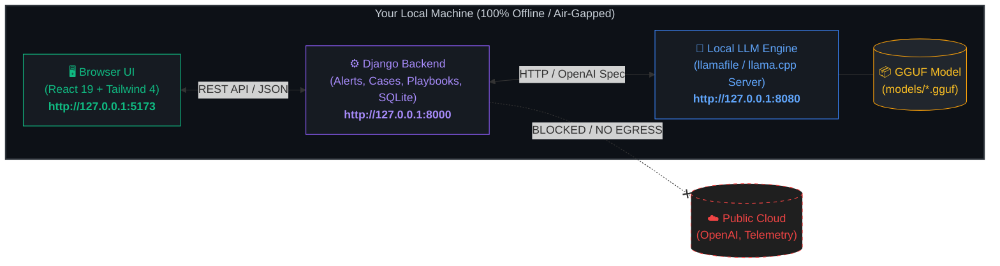

# 🛡️ IntrovertSOC

<p align="center">
  
</p>

<p align="center">
  <strong>The 100% Offline, Privacy-First, Air-Gapped AI Security Operations Center (SOC)</strong><br />
  <em>Alert triage, case investigation, incident response, knowledge extraction, and automated playbooks — powered entirely by a local LLM.</em>
</p>

<p align="center">
  
  
  
  
  
  
</p>

---

## ⚡ 30-Second Quickstart

```powershell
# 1. Clone the repository
git clone https://github.com/Rajnayak0/IntrovertSOC.git
cd IntrovertSOC

# 2. Download llamafile.exe & your GGUF model into the models/ folder
# 3. Double-click setup.bat   (Installs dependencies & creates admin)
# 4. Double-click start.bat   (Launches everything & opens http://127.0.0.1:5173)
```

---

## 📑 Table of Contents
1. [🎯 Aim & Motive](#-aim--motive)
2. [🏗️ Architecture & Data Flow](#️-architecture--data-flow)
3. [📁 Folder Structure (Where Files Go)](#-folder-structure-where-files-go)
4. [✨ Key Features & Chat Modes](#-key-features--chat-modes)
5. [🧠 Best Models & Hardware Requirements](#-best-models--hardware-requirements)
6. [📋 Prerequisites](#-prerequisites)
7. [🖱️ One-Click Batch Files (.bat)](#️-one-click-batch-files-bat)
8. [🚀 Step-by-Step Daily Usage](#-step-by-step-daily-usage)
9. [🔧 Troubleshooting & Common Issues](#-troubleshooting--common-issues)
10. [📜 Attribution & License](#-attribution--license)

---

## 🎯 Aim & Motive

### 🛑 The Problem with Cloud AI in Cybersecurity
Mainstream AI security tools send raw security logs, active intrusion alerts, firewall telemetry, user credentials, and internal network maps to commercial third-party cloud LLMs (OpenAI, Anthropic, Google, etc.).

For security operations centers, defense contractors, financial institutions, and privacy-conscious organizations, this creates immediate regulatory violations (**GDPR, HIPAA, SOC 2, ISO 27001, Defense/Gov standards**) and risks catastrophic corporate espionage through third-party data breaches.

### 🛡️ The Solution: IntrovertSOC
**IntrovertSOC** is an air-gapped, sovereign AI Security Operations Center engineered from the ground up to keep **all security intelligence strictly within your perimeter**:
- **Zero Cloud Egress:** Operates exclusively over `127.0.0.1`. The application makes **zero outbound requests** to cloud LLM providers, collects no telemetry, and requires no API keys.
- **Lightweight & Self-Contained:** Stripped of complex distributed infrastructure. No PostgreSQL, Redis, Kafka, or LDAP clusters are required. Runs efficiently on **SQLite** and background worker threads.
- **Local GGUF Acceleration:** Powered by Mozilla's high-performance `llamafile` / llama.cpp runtime, utilizing your GPU (NVIDIA CUDA, AMD ROCm, Apple Metal) or CPU without friction.
- **Modern Dark-Mode UI:** High-density, tactical user interface built with **React 19** and **Tailwind CSS 4**.

---

## 🏗️ Architecture & Data Flow

All communication remains strictly on the local machine (`localhost / 127.0.0.1`):



---

## 📁 Folder Structure (Where Files Go)

When setting up IntrovertSOC, place your model and engine files as shown below:

```text
IntrovertSOC/
│
├── models/
│   ├── llamafile.exe               <-- Place downloaded llamafile binary here
│   └── Qwen3-4B-Q4_K_M.gguf        <-- Place your .gguf model weights here
│
├── backend/                        <-- Python 3.13 Django API, SQLite DB & playbooks
├── frontend/                       <-- React 19 + Vite + Tailwind CSS dashboard
├── docs/                           <-- In-depth model benchmarks and network docs
│
├── setup.bat                       <-- 1. Double click once to initialize environment
├── start.bat                       <-- 2. Double click to start all 3 servers
├── stop.bat                        <-- 3. Double click to cleanly stop all servers
└── local-paths.bat.example         <-- Optional: Rename if model is on another drive
```

---

## ✨ Key Features & Chat Modes

IntrovertSOC features three switchable **LLM Persona Modes** right from the top navigation bar. Every triage report, IOC analysis, and chat interaction adapts instantly:

| Mode | Personality | Best For |
|---|---|---|
| 💼 **Work Mode** | Comprehensive, structured markdown reports with executive summaries, risk scores, IOC lists, and MITRE ATT&CK mappings. | Formal incident documentation, audit trails, and reporting to leadership. |
| 🤫 **Introvert Mode** | Direct, factual, stripped of conversational filler, pleasantries, and chatter. | Everyday tier-1/tier-2 alert triage when speed is key. |
| ⚡ **Super Introvert** | Maximum brevity — clipped 1 to 2-line direct answers. | Rapid-fire command-line style triage during active incident response. |

---

## 🧠 Best Models & Hardware Requirements

IntrovertSOC runs any GGUF-quantized model via `llamafile` (or any OpenAI-compatible server on port 8080).

### What is Quantization (`Q4_K_M`)?
Quantization reduces large model weights from 16-bit precision to 4-bit integers.  
👉 **`Q4_K_M` is the recommended standard**: it shrinks RAM/disk consumption by ~70% while preserving over 98% of full analytical reasoning.

### Hardware Tier & Recommended Model Matrix

| Hardware Tier | Available RAM / VRAM | Recommended Model | File Size | Strengths |
|---|---|---|---|---|
| **Entry-Level (Standard Laptop)** | **4 GB – 8 GB RAM** | **Qwen3-4B-Instruct (`Q4_K_M`)** ⭐ *(Default)* | **~2.49 GB** | Default tested model. Runs on almost any machine, near-zero latency, reliable alert extraction. |
| **Budget / Ultra-Light** | 2 GB – 4 GB RAM | **Qwen3-1.7B-Instruct (`Q4_K_M`)** | ~1.2 GB | Runs on low-spec systems or mini-PCs. |
| **Mid-Range (Standard Workstation)** | **16 GB RAM** (or 8GB GPU) | **Qwen3-8B-Instruct (`Q4_K_M`)** | ~4.7 GB | Noticeably sharper case assessments, reliable JSON structured outputs. |
| **Heavy Analyst Rig** | 16 GB – 24 GB RAM | **Qwen3-14B-Instruct (`Q4_K_M`)** | ~9.0 GB | Superior playbook decision making and multi-step investigation logic. |
| **High-End Workstation** | 24 GB – 32 GB RAM | **Qwen3-32B-Instruct (`Q4_K_M`)** | ~20 GB | Enterprise-grade reasoning without any external connection. |
| **Enterprise Server** | 48 GB – 64 GB+ RAM | **Qwen3-72B-Instruct (`Q4_K_M`)** | ~43 GB | Flagship-class deep cyber threat intelligence extraction. |

### Download Links
1. **Download `llamafile` binary:**  
   👉 [Mozilla llamafile Releases (GitHub)](https://github.com/Mozilla-Ocho/llamafile/releases)  
   *(Download `llamafile-x.x.x.exe`, rename to `llamafile.exe`, and place in `models/`)*
2. **Download Model File:**  
   👉 [Download Qwen3-4B-Q4_K_M.gguf from Hugging Face](https://huggingface.co/Qwen/Qwen3-4B-GGUF)  
   *(Place the `.gguf` file inside `models/`)*

---

## 📋 Prerequisites

Before running the application on Windows, ensure the following prerequisites are installed:

1. **Python Package Manager (`uv`)**  
   Open PowerShell and run:
   ```powershell
   winget install astral-sh.uv
   ```
2. **Node.js (LTS 20+)**  
   ```powershell
   winget install OpenJS.NodeJS.LTS
   ```

---

## 🖱️ One-Click Batch Files (.bat)

IntrovertSOC comes with pre-configured batch scripts in the project root. **You do not need to create these manually** — they are already included in your clone!

### 1. `setup.bat` (Run Once)
Checks prerequisites, installs backend Python dependencies via `uv`, creates database tables, lets you create an admin account, and installs frontend packages.
<details>
<summary><b>Click to expand and view <code>setup.bat</code> source code</b></summary>

```bat
@echo off
setlocal EnableExtensions
cd /d "%~dp0"
title IntrovertSOC setup

echo ============================================
echo  IntrovertSOC - one-time setup
echo ============================================
echo.

where uv >nul 2>&1 || goto no_uv
where node >nul 2>&1 || goto no_node
where npm >nul 2>&1 || goto no_node

echo [1/3] Backend: installing Python dependencies...
pushd "%~dp0backend"
uv sync
if errorlevel 1 goto fail

echo.
echo [2/3] Database: creating tables...
uv run python manage.py migrate
if errorlevel 1 goto fail

echo.
echo [3/3] Creating your login account.
echo       (Username + password of your choice. Press Ctrl+C to skip if
echo        you already created one before.)
uv run python manage.py createsuperuser
popd

echo.
echo [3/3] Frontend: installing JavaScript dependencies (slow first time)...
pushd "%~dp0frontend"
call npm install
if errorlevel 1 goto fail
popd

echo.
echo ============================================
echo  SETUP DONE
echo  Next step: double-click start.bat
echo  (it opens the browser at http://127.0.0.1:5173)
echo ============================================
pause
exit /b 0

:no_uv
echo [MISSING] "uv" - the Python tool runner.
echo.
echo Install it first, then run setup.bat again:
echo    winget install astral-sh.uv
echo    (or see https://docs.astral.sh/uv/getting-started/installation/)
pause
exit /b 1

:no_node
echo [MISSING] Node.js / npm.
echo.
echo Install Node.js 20 or newer, then run setup.bat again:
echo    winget install OpenJS.NodeJS.LTS
echo    (or download from https://nodejs.org)
pause
exit /b 1

:fail
echo.
echo SETUP FAILED - read the error message above, fix it, run setup.bat again.
pause
exit /b 1
```
</details>

---

### 2. `start.bat` (Daily Launcher)
Auto-detects `llamafile.exe` and your `.gguf` file in `models\`, starts backend (`:8000`), frontend (`:5173`), and local LLM (`:8080`) in three terminal windows, and automatically opens your browser.
<details>
<summary><b>Click to expand and view <code>start.bat</code> source code</b></summary>

```bat
@echo off
setlocal EnableExtensions
cd /d "%~dp0"
title IntrovertSOC launcher

rem =====================================================================
rem Config - only needed if auto-detect gets it wrong. local-paths.bat
rem (created on first run) takes priority over anything set here.
rem =====================================================================
set "LLAMAFILE_EXE="
set "GGUF_MODEL="

rem --- Remembered paths from a previous run ---
if exist "%~dp0local-paths.bat" call "%~dp0local-paths.bat"

rem --- Auto-detect the llamafile binary ---
if not defined LLAMAFILE_EXE if exist "%~dp0llamafile.exe" set "LLAMAFILE_EXE=%~dp0llamafile.exe"
if not defined LLAMAFILE_EXE if exist "%~dp0models\llamafile.exe" set "LLAMAFILE_EXE=%~dp0models\llamafile.exe"
if not defined LLAMAFILE_EXE if defined LLAMAFILE set "LLAMAFILE_EXE=%LLAMAFILE%"

rem --- Auto-detect the first .gguf in models\ ---
if not defined GGUF_MODEL for %%F in ("%~dp0models\*.gguf") do if not defined GGUF_MODEL set "GGUF_MODEL=%%~fF"
if not defined GGUF_MODEL if defined LLAMAFILE_MODEL_PATH set "GGUF_MODEL=%LLAMAFILE_MODEL_PATH%"

rem --- check mode: print detection status, launch nothing ---
if /i "%~1"=="check" goto check

rem --- Refuse to start a second stack: two backends on one port cause session/CSRF mixups ---
netstat -ano | findstr /c:":8000 " | findstr LISTENING >nul 2>&1
if not errorlevel 1 goto already_running
netstat -ano | findstr /c:":5173 " | findstr LISTENING >nul 2>&1
if not errorlevel 1 goto already_running

rem --- Ask once for whatever is still missing, then remember it ---
if not defined LLAMAFILE_EXE (
    echo No llamafile binary found.
    set /p "LLAMAFILE_EXE=Full path to your llamafile .exe: "
)
if not defined GGUF_MODEL (
    echo No GGUF model found in models\.
    set /p "GGUF_MODEL=Full path to your .gguf model file: "
)
if not defined LLAMAFILE_EXE goto aborted
if not defined GGUF_MODEL goto aborted
if not exist "%LLAMAFILE_EXE%" (
    echo Not found: %LLAMAFILE_EXE%
    set "LLAMAFILE_EXE="
    goto aborted
)
if not exist "%GGUF_MODEL%" (
    echo Not found: %GGUF_MODEL%
    set "GGUF_MODEL="
    goto aborted
)

if not exist "%~dp0local-paths.bat" (
    > "%~dp0local-paths.bat" echo set "LLAMAFILE_EXE=%LLAMAFILE_EXE%"
    >> "%~dp0local-paths.bat" echo set "GGUF_MODEL=%GGUF_MODEL%"
    echo Remembered these paths in local-paths.bat
)

rem --- Prerequisites ---
where uv >nul 2>&1 || goto no_uv
where node >nul 2>&1 || goto no_node

rem --- Launch three windows: backend, frontend, local model ---
echo Starting backend  (window 1, port 8000)...
start "IntrovertSOC backend"  /d "%~dp0backend"  cmd /k "uv run python manage.py runserver 127.0.0.1:8000"

echo Starting frontend (window 2, port 5173)...
start "IntrovertSOC frontend" /d "%~dp0frontend" cmd /k "npm run dev"

echo Starting local LLM (window 3, port 8080)...
netstat -ano | findstr /c:":8080 " | findstr LISTENING >nul 2>&1
if not errorlevel 1 (
    echo   port 8080 already has a model server - skipping llamafile
) else (
    start "IntrovertSOC LLM" cmd /k ""%LLAMAFILE_EXE%" -m "%GGUF_MODEL%" --server --host 127.0.0.1 --port 8080"
)

echo.
echo Waiting for the servers to come up...
timeout /t 6 /nobreak >nul
start "" http://127.0.0.1:5173

echo.
echo IntrovertSOC is starting. Three windows are open:
echo    1 backend   2 frontend   3 local model
echo Keep them open while you use it. Close them (or run stop.bat) to stop.
echo First login: the account you created in setup.bat.
pause
exit /b 0

:check
echo ==== IntrovertSOC launch check ====
if defined LLAMAFILE_EXE (echo llamafile : %LLAMAFILE_EXE%) else (echo llamafile : NOT FOUND)
if defined GGUF_MODEL    (echo model     : %GGUF_MODEL%)     else (echo model     : NOT FOUND)
where uv >nul 2>&1  && (echo uv        : OK) || (echo uv        : MISSING - run setup.bat)
where node >nul 2>&1 && (echo node      : OK) || (echo node      : MISSING - run setup.bat)
if exist "%~dp0backend\.venv" (echo backend deps : installed) else (echo backend deps : missing - run setup.bat)
if exist "%~dp0frontend\node_modules" (echo frontend deps: installed) else (echo frontend deps: missing - run setup.bat)
exit /b 0

:already_running
echo.
echo IntrovertSOC is already running (port 8000 or 5173 is busy).
echo Starting a second copy breaks logins and mode switching.
echo Use it as-is, or run stop.bat first and then start.bat again.
pause
exit /b 1

:aborted
echo Nothing launched.
pause
exit /b 1

:no_uv
echo [MISSING] uv - run setup.bat first.
pause
exit /b 1

:no_node
echo [MISSING] Node.js - run setup.bat first.
pause
exit /b 1
```
</details>

---

### 3. `stop.bat` (Clean Shutdown)
Safely kills processes running on ports 8000, 5173, and 8080, and cleans up any orphan worker processes.
<details>
<summary><b>Click to expand and view <code>stop.bat</code> source code</b></summary>

```bat
@echo off
setlocal EnableExtensions
cd /d "%~dp0"

echo Stopping IntrovertSOC servers (ports 8000 backend, 5173 frontend, 8080 LLM)...

for %%P in (8000 5173 8080) do (
    for /f "tokens=5" %%I in ('netstat -ano ^| findstr /c:":%%P " ^| findstr LISTENING') do (
        echo   killing PID %%I on port %%P
        taskkill /f /pid %%I >nul 2>&1
    )
)

powershell -NoProfile -Command "Get-CimInstance Win32_Process | Where-Object { ($_.CommandLine -match 'manage\.py runserver' -and $_.CommandLine -match 'IntrovertSOC') -or ($_.CommandLine -match 'vite\.js' -and $_.CommandLine -match 'IntrovertSOC') -or ($_.Name -eq 'uv.exe' -and $_.CommandLine -match 'manage\.py runserver') } | ForEach-Object { Write-Host ('  killing orphan ' + $_.ProcessId + ' [' + $_.Name + ']'); Stop-Process -Id $_.ProcessId -Force -ErrorAction SilentlyContinue }"

echo Done.
pause
```
</details>

---

### 4. `local-paths.bat` (Optional Path Override)
If your model or llamafile is stored outside the repository (e.g. `C:\AI_Models\...`), create `local-paths.bat` in the root folder with:
```bat
set "LLAMAFILE_EXE=C:\AI_Models\llamafile.exe"
set "GGUF_MODEL=C:\AI_Models\models\Qwen3-4B-Q4_K_M.gguf"
```
*(This file is automatically ignored by `.gitignore` so your private machine paths are never pushed to GitHub).*

---

## 🚀 Step-by-Step Daily Usage

1. **Launch:** Double-click `start.bat`. Three terminal windows will appear (Django Backend, Vite Frontend, and llamafile Server).
2. **Access Web App:** Open `http://127.0.0.1:5173` in your browser.
3. **Log In:** Use the superuser account credentials created during `setup.bat`.
4. **Status Check:** Check the connection badge in the top right. It should display **Green (Connected)**.
5. **Investigate:** Ingest alerts, manage security cases, and trigger automated playbook investigations.
6. **Switch Persona:** Toggle between **Work**, **Introvert**, and **Super Introvert** at any time from the top bar.
7. **Shut Down:** When finished, double-click `stop.bat` to gracefully release all ports and shutdown background processes.

---

## 🔧 Troubleshooting & Common Issues

| Issue | Cause | Solution |
|---|---|---|
| **Port already in use error** | An existing background server is occupying port 8000, 5173, or 8080. | Run `stop.bat` to terminate lingering processes, then run `start.bat` again. |
| **CSRF verification failed** | Two backend processes are running simultaneously. | Run `stop.bat`, close browser tabs for `127.0.0.1`, and re-launch `start.bat`. |
| **Status dot is Grey / Disconnected** | `llamafile` failed to load model into RAM or port 8080 is blocked. | Inspect Window 3 (LLM terminal) for error output. Ensure the model fits your available RAM. |
| **Model outputting reasoning tags** | Model template leaking `<think>` tokens into content. | IntrovertSOC's `local_engine.py` automatically cleans reasoning tokens. Ensure you are using an Instruct GGUF model. |

---

## 📜 Attribution & License

IntrovertSOC is derived from [FunnyWolf/agentic-soc-platform](https://github.com/FunnyWolf/agentic-soc-platform) and licensed under the **MIT License**. See [LICENSE](LICENSE) for full details.
